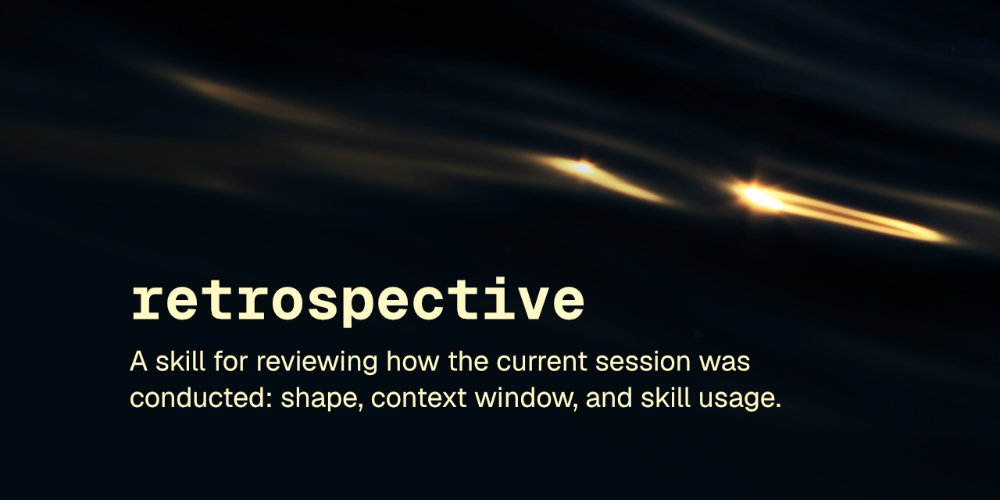

# retrospective

Post-session skill turns the session on itself. What shape did the work take, where did the context go, what should the next session inherit. No flattery.

 

A skill that reviews how the current session was *conducted* — not what it produced — from the conversation already in context. It classifies the session against a fixed taxonomy of shapes, scores how well it was run, names where the context window was spent badly, and turns repeatable hand-work into concrete improvements to the skills and workflows it used.

This skill follows the [Agent Skills specification](https://agentskills.io/specification) so it can be used by any skills-compatible agent.

## Installation

### npx skills
    npx skills add robcsaszar/retrospective

### Marketplace
    /plugin marketplace add robcsaszar/retrospective
    /plugin install robcsaszar-retrospective@retrospective

### Manually
Copy the `skills/retrospective/` directory into your project's `.claude/skills/`.

## What it does

Run it at the end of a working session with `/retrospective` (optionally `--focus spend` or `--focus wiring`). It is user-invoked by design — a retrospective is a deliberate act, not something to fire on its own.

The premise that makes it cheap and honest: the session is already the skill's context. There is no log to parse and no gathering step, so the review is grounded in what actually happened rather than inferred from a tool-call tally — and it never opens an on-disk transcript, including one handed to it as "the session to review."

It does three things. It **takes the session's shape**, classifying it as exactly one of six — Scope-then-Build, Run-the-Plan, Survey-then-Propose, Pinpoint Fix, Orchestrated Run, Contested Inquiry — and scoring it 1–10 against a shared key, so the classification is consistent across runs instead of a fresh label each time. It **accounts for the context**, naming the concrete moments where tokens were spent badly, each tied to one of five named economy rules with the specific different action for next turn, reasoned in relative magnitude and never a fabricated count. And it **wires the learning back**, folding a repeatable step performed by hand into the skill or workflow the session actually called, or briefing a new skill when nothing existing fits — written to a durable handoff note, best-effort, so the next session inherits it.

## License
[MIT](LICENSE) © Rob Csaszar
